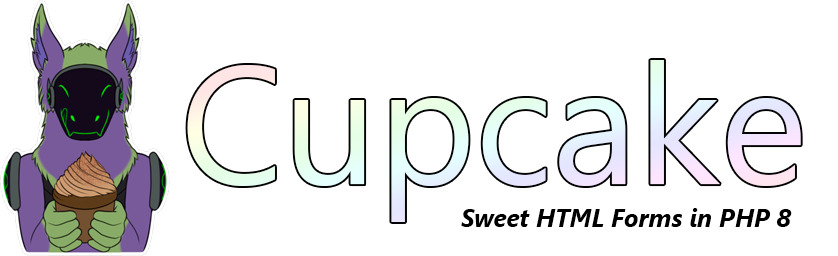

# 

[](https://github.com/soatok/cupcake/actions)
[](https://packagist.org/packages/soatok/cupcake)
[](https://packagist.org/packages/soatok/cupcake)
[](https://packagist.org/packages/soatok/cupcake)

Sweet and fast form processing for PHP projects.

**Requires PHP 8 or newer.**

## Installation

Use Composer to install this library:

```terminal
composer require soatok/cupcake
```

To learn how to use Cupcake, please see the **[Documentation](docs)** online.

## Questions and Answers

### Why "Cupcake"?

Wordplay! The German word for a cupcake mold is förmchen.

### What Does Cupcake Do That Other Form Libraries Don't?

Three things: Security, simplicity, and ease-of-use. 

First, I designed Cupcake with [security as its first principle](docs#-tenets-of-cupcake).

This doesn't *just* mean the bare basics like preventing cross-site scripting
vulnerabilities and cross-site request forgery. Secure form processing means ensuring that [input validation isn't only performed client-side](https://soatok.blog/2020/04/27/why-server-side-input-validation-matters/).
To that end, Cupcake uses [Ionizer](https://github.com/paragonie/ionizer) for input filtering.

Second, Cupcake's interface is deliberately simple and intuitive. Piece o' cake!

Finally, Cupcake is easy to integrate with other platforms and frameworks,
by design. Cupcake has minimal dependencies and is unlikely to conflict with
your existing framework dependencies or explode the code size to an unreasonable
level.

(In the future, I will also provide shims for popular frameworks and ORMs.)

### How Do I Use Cupcake?

See the [Documentation](docs) directory.

If the documentation isn't helpful, please
[file an issue on Github](https://github.com/soatok/cupcake/issues/new).

### What's With the Cupcake Mascot?

Their name is **[Neophyte](docs/Neophyte)**! (They/them pronouns.)

Neophyte is a character owned by [Soatok](https://soatok.blog)
(the creator of Cupcake) to represent people who read his blog or
use his open source software.

### Is Cupcake a Furry Project?


The author, Soatok, is a furry. [The mascot](docs/Neophyte)
is a protogen (a fictitious species created within the furry fandom,
for the furry fandom to enjoy).

You can learn more about the Furry Fandom [here](https://soatok.blog/2020/04/23/never-underestimate-the-furry-fandom/).
